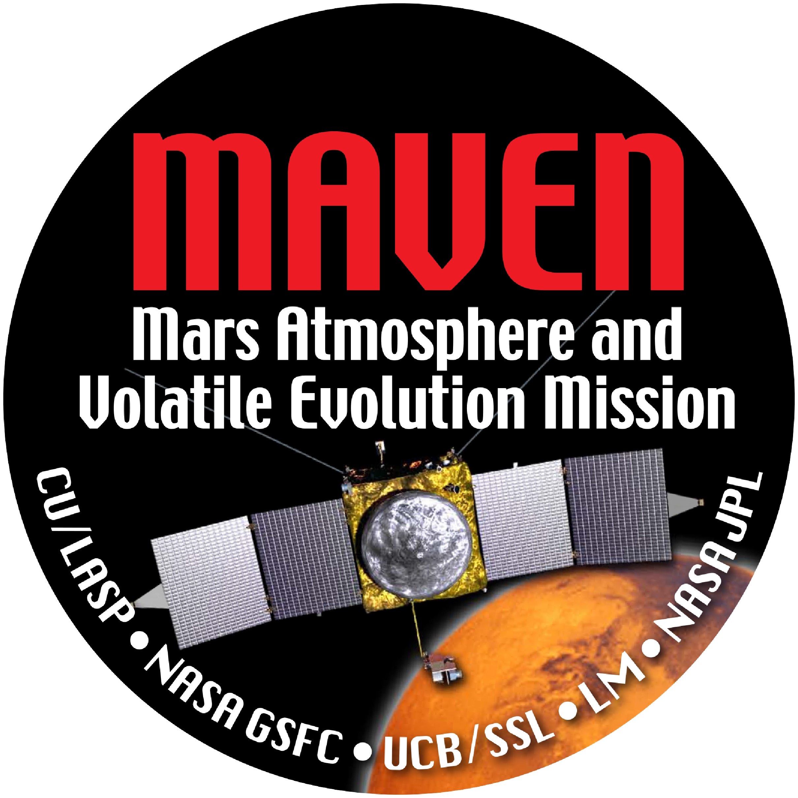
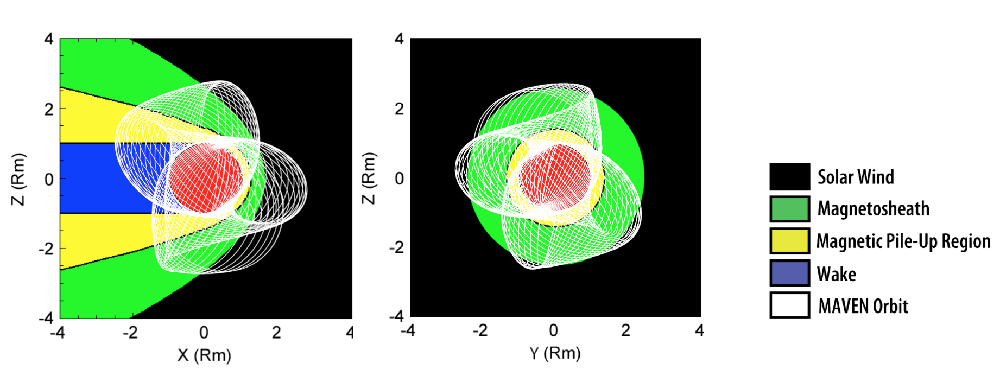
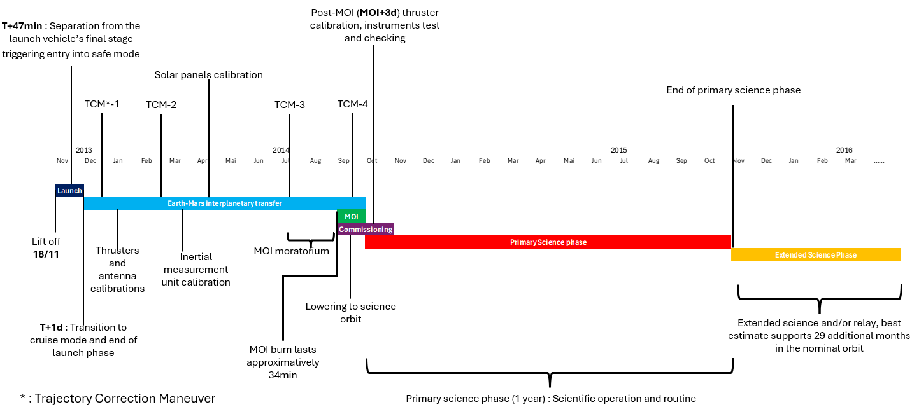
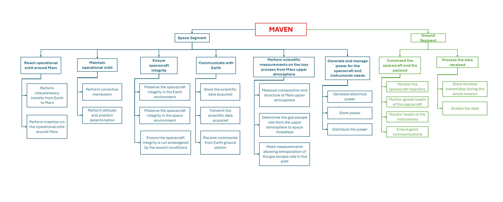

# MAVEN Reverse Engineering

Reverse-engineering of the **MAVEN** Mars mission (Mars Atmosphere and Volatile
EvolutioN), built from public sources and the accompanying design report.

MAVEN is the first spacecraft focused primarily on the state and evolution of
the Martian upper atmosphere. It launched on 18 Nov 2013 aboard an Atlas V-401
and entered an elliptical orbit around Mars on 21 Sep 2014. This repository
documents the reconstructed design of the mission and of each spacecraft
subsystem, together with the simulations that support it.

The single authoritative source is
[`maven-reverse-engineering-report.pdf`](maven-reverse-engineering-report.pdf):
every subsystem folder mirrors one section of the report, and every number in
these READMEs traces back to it.

## Contributors

- Matteo Mafrici
- Mario Guida
- Martina Lucia Magarelli
- Camilla Martino
- Jules Jean Laurence Simon
- Andrea Garghetti

## Mission overview

The mission goal is to determine how gas particles escape from the top of the
Martian atmosphere to space, and to use that knowledge to estimate how much
atmosphere Mars has lost over the last four billion years — explaining the
past oceans and rivers and the question of planetary habitability.

**High-level goals**

1. Measure the composition, structure and dynamics of the upper atmosphere and
   ionosphere, and determine the processes controlling them.
2. Measure the rate of loss of gas from the top of the atmosphere to space,
   and its relation to the controlling processes.
3. Determine the properties that allow extrapolating this escape rate
   backwards in time, when the solar wind and solar UV were greater, to
   estimate the total amount of gas lost.

The design is driven by the orbit: a highly elliptical science orbit samples
both ends of the escape mechanism on every pass — at apoapsis (> 6,200 km)
beyond the bow shock, where the undisturbed upstream solar wind is measured,
and at periapsis (~150 km) inside the thermosphere, where atmospheric escape
actually occurs. Periodic **Deep-Dip** campaigns temporarily lower periapsis to
~125 km to characterize the lower thermosphere and homopause region.

### Requirements

Mission requirements:

| REQ-ID | Statement |
|---|---|
| MAV-MIS-001 | The mission shall characterize the current state of the upper atmosphere and ionosphere of Mars. |
| MAV-MIS-002 | The spacecraft shall determine the current rates of atmospheric escape to space. |
| MAV-MIS-003 | The mission duration shall be at least one Earth year in the primary science orbit. |
| MAV-MIS-004 | The mission orbit shall have a periapsis altitude of 160 km, an apoapsis of 6300 km, a period of 4.5 hr, and an inclination of 74.2° in the Primary Phase. |
| MAV-MIS-005 | The mission orbit shall have a periapsis altitude of 130 km, an apoapsis of 6300 km, a period of 4.5 hours and an inclination of 74.2° in the Deep Dip Phase. |

System requirements:

| REQ-ID | Statement |
|---|---|
| MAV-SYS-001 | The system shall provide 3-axis attitude stabilization with an accuracy of 0.5° or less. |
| MAV-SYS-002 | The OBDH system shall be capable of storing 24 hours of science data in the event of a ground station outage. |
| MAV-SYS-003 | The solar arrays shall generate a minimum of 1150 W at Mars aphelion to support nominal spacecraft operations. |
| MAV-SYS-004 | The battery system shall support a maximum DoD of 40% during the longest predicted eclipse duration (90 minutes). |
| MAV-SYS-005 | The spacecraft shall support communication with the ground segment using the antennas during the post-launch phase, during MOI, during science operations and when the spacecraft is in the safe mode. |
| MAV-SYS-006 | All external surfaces shall withstand the Martian solar flux at aphelion. |
| MAV-SYS-007 | The spacecraft shall maintain all subsystem temperatures within their QTR of −30 °C to +50 °C during all mission phases. |
| MAV-SYS-008 | The spacecraft shall be capable of autonomous "Safe Mode" entry upon detection of a critical system failure. |

### Mission phases

1. **Launch** — Cape Canaveral, Atlas V-401, 36-day window from 18 Nov 2013.
2. **Earth–Mars transfer** — ~10 months, trajectory correction maneuvers,
   instrument checkout and calibration.
3. **MOI** — Mars capture maneuver into a highly elliptical orbit.
4. **Primary science phase** — one year in the nominal science orbit.
5. **Extended science phase** — up to six years of continued observations and
   relay support (best estimate 29 additional months in the nominal orbit,
   then a higher orbit with periapsis ~200 km).

### Payload

Three science packages plus the Accelerometer (ACM) used to determine the
atmospheric density near periapsis:

- **Particles and Fields Package** — STATIC (ions to escape velocity), SEP
  (solar energetic particles), SWIA (solar wind / magnetosheath ions), SWEA
  (magnetosheath electrons), LPW (electron density/temperature, electric field
  waves), EUV Monitor (solar EUV input), MAG (magnetic field).
- **Remote Sensing Package** — IUVS: UV spectra in four observing modes (limb
  scans, planetary mapping, coronal mapping, stellar occultations).
- **Mass Spectrometry Package** — NGIMS: in-situ neutral composition, isotopic
  ratios and scale-height temperatures of the upper atmosphere.

IUVS, STATIC and NGIMS are mounted on the Articulated Payload Platform (APP) so
they can point independently of the spacecraft attitude; SWIA, SEP and EUV keep
a fixed Sun-pointed orientation.

### Functional analysis

The functional tree decomposes the mission into the main functions performed by
the space segment and the ground segment to achieve the high-level goals.

## Subsystem overview

Each subsystem folder is a self-contained reverse-engineering report mirroring
the corresponding section of the main report:

| Subsystem | Folder | Scope |
|---|---|---|
| Mission analysis & propulsion | [`subsystems/ma-ps`](subsystems/ma-ps) | Earth–Mars transfer, ΔV budget, propulsion sizing, science-phase STK simulation |
| AOCS | [`subsystems/aocs`](subsystems/aocs) | sensors, actuators, attitude modes, pointing / disturbance / sizing budgets, STK attitude simulation |
| EPS | [`subsystems/eps`](subsystems/eps) | solar arrays, batteries, bus regulation, power-cycle simulation over the deep-dip window |
| TCS | [`subsystems/tcs`](subsystems/tcs) | passive thermal control, heater sizing, subsystem budgets |
| TTMTC | [`subsystems/ttmtc`](subsystems/ttmtc) | X-band Earth link, UHF/Electra relay, DSN ground segment, link budgets |
| STR | [`subsystems/str`](subsystems/str) | box-and-panels bus, materials, mechanisms, launcher accommodation |
| OBDH | [`subsystems/obdh`](subsystems/obdh) | centralized CDH, store-and-forward, data budget, mass |

## Key results

The reverse-engineered mass budget (report, reverse-engineering table):

| Item | Mass [kg] |
|---|---|
| Total dry mass (w/o adapter) | 794.94 |
| System margin (20% of nominal dry) | 158.99 |
| Total dry mass w/ margin (w/o adapter) | 953.93 |
| Propellant + pressurant | 1322 |
| Total wet mass (w/o adapter) | 2275.93 |
| Adapter mass | 106.1 |
| **Total launch mass (w/ adapter)** | **2382.03** |
| Maximum launchable mass (Atlas V-401) | 3600 |

The launch mass stays ~34% below the Atlas V-401 capability, above the 25%
margin target of the mass-budget philosophy. The reconstructed science orbit is
a 75°-inclination ellipse of ~150 × 6000 km with a 4.5 h period; the onboard
data-handling chain closes at ~44.6 kbps against a 271 kbps HGA downlink.

## What you can clone and use

The repository is designed to be cloned and explored without external
dependencies beyond the free tools listed below:

- **Read-only usage** — every `subsystems/*/README.md` is a complete summary;
  no tool is needed to read the design.
- **STK** — the `stk/maven-stk-scenario` folder holds a full STK 13 scenario
  (spacecraft model, Astrogator mission control sequence, RF chain, facilities,
  access/link-budget reports) that reproduces the science orbit and the deep
  dip over **11–23 Feb 2015**.
- **MATLAB** — runnable pipelines live in `subsystems/eps/matlab/` (full power
  cycle, MATLAB R2026a) and `subsystems/tcs/matlab/` (heater sizing and
  budgets); `subsystems/ma-ps` contains the Lambert launch-window scan and the
  science-orbit propagation scripts. Output data (CSV / MAT) land in the
  corresponding `data/` folders.
- **Report** — [`maven-reverse-engineering-report.pdf`](maven-reverse-engineering-report.pdf)
  is the single source for every file in this repo.

## Reproducibility

Everything in this repository is reproducible from the two sources below.
Each subsystem README documents the exact tools, run order and expected
outputs for its own pipelines.

- **Simulations** — the STK scenario under `stk/maven-stk-scenario` and the
  MATLAB pipelines in `subsystems/*/matlab/` are self-contained; their inputs
  are tracked in the repo, so re-running them regenerates the same exports and
  figures. See the "Reproducibility" section of each subsystem folder for the
  tool version and analysis intervals.
- **Report** — every number in these READMEs traces back to
  [`maven-reverse-engineering-report.pdf`](maven-reverse-engineering-report.pdf),
  the single authoritative source for the design.

## License

The reverse-engineering work in this repository (code, data, text, figures)
is released under the [MIT License](LICENSE). NASA material used in the
project — mission logo, images and public press-kit data — is in the public
domain (US government work).
