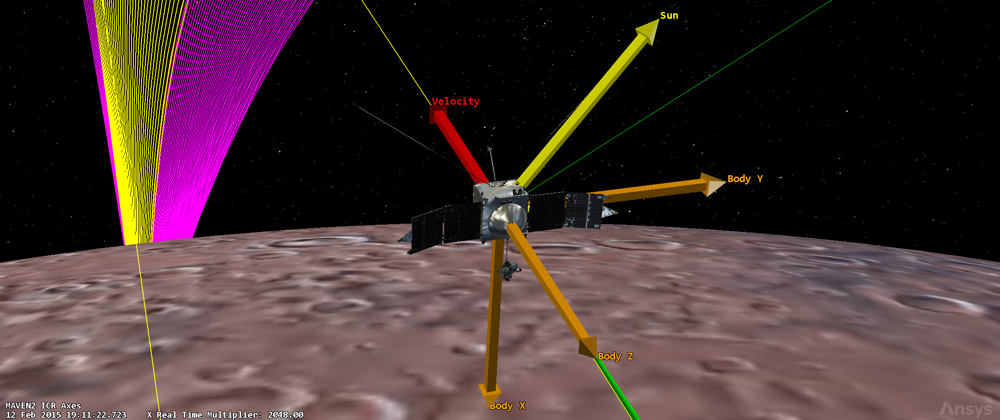
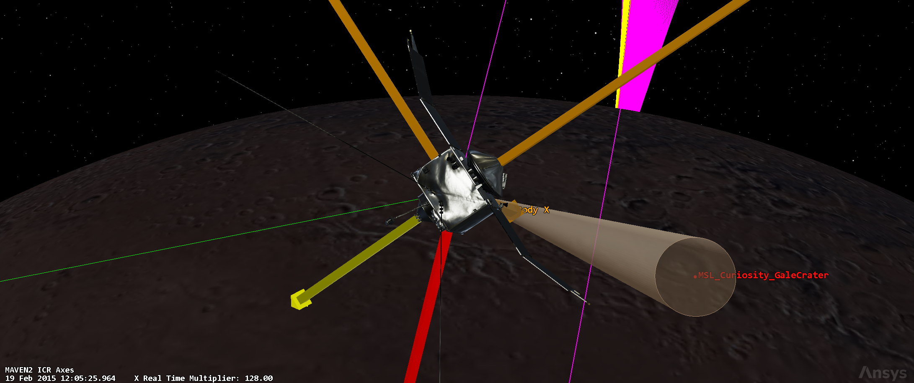

# MAVEN Attitude & Orbit Control System (AOCS)

AOCS design for MAVEN: the sensor suite, the actuation system, the attitude
control modes and the reverse-engineered pointing / disturbance / sizing
budgets. Full architecture and calculations are in
[`maven-reverse-engineering-report.pdf`](../../maven-reverse-engineering-report.pdf).

## Key results

### Architecture

Zero-momentum, three-axis stabilized spacecraft. Attitude control is always
performed on all three body axes: the four reaction wheels provide fine
control in science, communication and slew modes, while the eight ACS
thrusters take over during Safe Mode, large Δv burns and wheel-momentum
unloading.

### Attitude sensors

| Sensor | Model | Count | Role |
|---|---|---|---|
| Star trackers | A-STR | 2 | high-accuracy 3-axis attitude, arcsecond precision (AKE ≤ 0.003°) |
| Sun sensors | Redwire CSS | 2 | coarse attitude, Safe Mode, initial acquisition |
| MIMUs | Honeywell Block 3 | 2 | IMU-1 primary, IMU-2 backup; each with 3× QA-3000 accelerometers + 3× GG 1320 RLG |

The star trackers sit on the bus with unobstructed FOV, aligned with the −Y_MIMU
direction (−X_M axis); the MIMUs are on the upper deck. The onboard Periapsis
Timing Estimator (PTE), fed by the accelerometers, keeps the periapsis timing
within the 20 s accuracy requirement with ephemerides uploaded twice weekly.

### Actuators

| Actuator | Model | Count | Configuration |
|---|---|---|---|
| Reaction wheels | HR16-100, 100 N·m·s | 4 | four-sided pyramid (3-axis authority + single-wheel redundancy) |
| ACS thrusters | MR-103G, 1 N | 8 | pairs for desaturation, lever arm 1.15 m |

Desats (~0.47 mm/s average during cruise) are performed about once per week
during cruise and once per orbit during science.

### Attitude control modes

| Mode | Task | Solution |
|---|---|---|
| Safe Mode | rate damping, +Z to Sun, slow spin, LGA link | 3-axis control (CSS + ACS) |
| Sun-Velocity | inbound/outbound legs, +Z to Sun, ±Y along velocity | 3-axis control (RW) |
| Fly-Y | nominal periapsis, +Y ram, +X nadir | 3-axis control (RW) |
| Fly-Z | deep-dip periapsis (~125 km), −Z ram, passive aero stability | 3-axis control (RW) + aero |
| HGA | Earth point, +Z to Earth, 5 h sessions twice weekly | 3-axis control (RW) |
| Delta-V | attitude hold during burns, rate damping | 3-axis control (RW + ACS) |
| Slew | mode transitions, ~90° rotations | 3-axis control (RW) |

### Pointing performance (APE / AKE, 3σ)

Closed-loop estimate from the STK attitude simulation plus an analytical RW
PD control law (bandwidth f_ctrl ≈ 0.02 Hz, attenuation 5–10×).

| Mode | Required APE / AKE | Provided APE | Status |
|---|---|---|---|
| HGA | ≤ 0.25° / 0.02° | 0.12° | compliant |
| Fly-Z (periapsis) | ≤ 0.30° / 0.05° | 0.55° | **non-compliant** |
| Fly-Y (periapsis) | ≤ 0.30° / 0.05° | 0.38° | **non-compliant** |
| UHF (relay) | ≤ 1.00° / 0.10° | 0.65° | compliant (not simultaneous with HGA) |
| Safe Mode | ≤ 5.00° / 1.00° | 4.20° | compliant |
| Slew | ≤ 0.25° / 0.05° | 0.20° | compliant |

Fly-Z and Fly-Y marginally exceed the 0.30° requirement, driven by the
dominant aerodynamic torque at h_p = 125 km (τ_aero ≈ 66 mN·m nominal in
Fly-Z). Recovery paths: tighten RW bandwidth, reduce the CP–COM offset via
propellant budget management, or accept the relaxed science-operations APE.

### Disturbance torques (from the STK Astrogator propagator)

| Disturbance | Fly-Z (peri) | Fly-Y (peri) | Safe Mode | E_HGA (apo) | Sun-Vel |
|---|---|---|---|---|---|
| τ_gg [mN·m] | 5.85 | 5.85 | 1.20 | 0.29 | 0.29 |
| τ_aero [mN·m] | 66.3 | 33.2 | ≈ 0 | ≈ 0 | ≈ 0 |
| τ_SRP [mN·m] | 0.035 | 0.035 | 0.035 | 0.035 | 0.035 |
| **τ_tot [mN·m]** | **72.18** | **39.09** | **1.24** | **0.33** | **0.32** |

Third-body contribution is below 0.001 mN·m and neglected. Input data:
m_sc ≈ 1400 kg, I = 4850 / 1150 / 5100 kg·m², r_p = 3514.5 km (h_p = 125 km),
v_p = 4225 m/s, ρ(125 km) = 0.5–5×10⁻⁸ kg/m³, A_eff (Fly-Z) = 12 m², lever arm
ℓ_CP−COM = 0.5 m.

### Slew maneuvers (trapezoidal 10/80/10% profile)

Slew segments were extracted from the STK attitude schedule (12 transitions)
and modeled with a trapezoidal angular-rate profile; torques computed about
the dominant Z axis (I_zz = 5100 kg·m²).

| Segment | Δθ [°] | t_slew [s] | ω_max [°/s] | τ_Izz [mN·m] |
|---|---|---|---|---|
| VTS1 SV→HGA | 60 | 300 | 0.250 | 742 |
| VTS2 HGA→SV | 60 | 300 | 0.250 | 742 |
| 2_SLEW_walkin | 45 | 300 | 0.188 | 556 |
| **VTS3 prop→FlyZ (worst)** | **90** | **249** | **0.452** | **1619** |
| VTS4 FlyZ→Safe | 90 | 300 | 0.375 | 1113 |
| VTS6 Safe→FlyZ | 90 | 300 | 0.375 | 1113 |
| VTS5 FlyZ→prop | 45 | 300 | 0.188 | 556 |
| 6_SLEW_2flyy | 90 | 1257 | 0.090 | 63 |
| Slew→MSL target | 30 | 500 | 0.075 | 134 |
| Slew←MSL | 30 | 500 | 0.075 | 134 |
| VTS7 FlyY→HGA | 60 | 300 | 0.250 | 742 |
| VTS8 HGA→FlyY | 60 | 300 | 0.250 | 742 |

The worst-case momentum exchanged during a slew (VTS3:
τ·t_ramp = 1.619 N·m × 24.9 s = 40.3 N·m·s) stays well below the 100 N·m·s RW
saturation limit.

### Actuator sizing

Worst case assumes a single operational RW, a full 180° reorientation at
0.5°/s: T_slew = 0.1208 N·m, t_slew = 728.37 s, H_slew,max = 44 N·m·s —
below the 100 N·m·s saturation, preserving momentum margin for disturbance
rejection without immediate desaturation.

### Desaturation fuel mass

With τ_tot = 72.18 mN·m acting over 20 s at periapsis: equivalent orbit-mean
torque 1.78×10⁻⁴ N·m, H_orb = 2.88 N·m·s. One desat per orbit (2 thrusters,
1 N, L = 1.15 m) → t_desat = 1.25 s, 1948 desats/year, total impulse
4870 N·s, I_sp = 213 s → **m_prop = 2.33 kg**.

### Mass, power & data budget

| | Component | Mass [kg] | Power [W] | Data [kbps] |
|---|---|---|---|---|
| Sensors | ST (×2) | 3.55 | 8.9 | 2.0 |
| | IMU (×2) | 4.6 | 25.0 | 4.0 |
| | Sun sensors (×2) | 0.13 | — | 0.5 |
| Actuators | RW (×4) | 12 | 22.0 | 1.0 |
| | ACS thrusters (×8) | 0.37 | — | 0.5 |
| | AOCS valves (×2) | — | 16.1 | — |
| System | Propellant | 2.33 | — | — |
| | AOCS electronics | 27.23 | 15.0 | — |
| | Housekeeping | — | — | 2.0 |
| Margins | | — | 20% | — |
| **Total AOCS budget** | | **97.08** | **237.16** | **10** |

The AOCS total mass represents 12% of the 809 kg dry mass
(m_aocs,tot = 97.08 kg).

## AOCS simulation (STK)

The attitude history and orbital data are direct STK exports over the first
deep-dip campaign window **11–23 Feb 2015** (MAVEN2, see
[`subsystems/ma-ps`](../ma-ps) for the underlying Astrogator MCS: walk-in
12 Feb 2015 11:55, walk-out 17 Feb 2015 12:26). The files correspond to the
report's `STK_MAVEN_*` exports.





### `attitude-schedule.txt`

25 attitude segments covering all modes (report `STK_MAVEN_Attitude_Schedule.txt`):

- **12 attitude holds** (Aligned and Constrained): SUN_VELOCITY cruise,
  COMM_HGA, SUN_VELOCITY, DeltaV_OTM walk-in, FLYZ_Drag (×2 + Safe-mode
  anomaly simulation), DeltaV_PCM walk-out, FLYY (×3), COMM_HGA, FLYY.
- **12 slews** (Variable Time Slew / Fixed Rate Slew): VTS1–VTS8,
  2_SLEW_walkin, 6_SLEW_2flyy and the two Slew segments bracketing the UHF
  pass.
- **1 target hold**: MSL_Curiosity_GaleCrater (UHF relay pass,
  19 Feb 2015 11:21–12:20).

This is the 12-segment attitude history covering all modes that feeds the
pointing-budget simulation of the report.

### `classical-orbit-elements.txt`

J2000 classical elements (semi-major axis, eccentricity, inclination, RAAN,
argument of perigee, true/mean anomaly) sampled at ~1 min over the window
(report `STK_MAVEN_Classical_Orbit_Elements.txt`). The deep-dip manoeuvres
are visible in the periapsis altitude derived from a(1−e):

| Epoch | a [km] | e | h_p [km] |
|---|---|---|---|
| 11 Feb 2015 12:00 (nominal science) | 6581.2 | 0.461 | ~150 |
| during deep dip (12–17 Feb) | 4621–6277 | 0.23–0.44 | ~116–154 |
| 23 Feb 2015 14:25 (end of window) | 4504.5 | 0.212 | ~154 |

### `inertial-acceleration.txt`

Inertial acceleration components ax/ay/az [km/s²] sampled at ~1 min (report
`STK_MAVEN_Inertial_Acceleration.txt`). Peak magnitude 0.00346 km/s² at
12 Feb 2015 14:43 (deep-dip periapsis); minimum 0.00047 km/s² at
11 Feb 2015 14:11 (apoapsis). This is the basis for the atmospheric density
estimate ρ(125 km) = 0.5–5×10⁻⁸ kg/m³ used in the disturbance model.

### `yaw-pitch-roll.txt`

Yaw, pitch and roll angles [deg] of the MAVEN2 body frame w.r.t. the J2000
reference, sampled at ~1 min over the window. The time series shows the
attitude holds (quasi-steady plateaus) and the rapid transitions of the 12
slew segments.

## Folder contents

```
aocs/
├── attitude-schedule.txt         # STK attitude schedule (25 segments)
├── classical-orbit-elements.txt  # J2000 classical elements time series
├── inertial-acceleration.txt     # inertial acceleration time series
├── yaw-pitch-roll.txt            # body attitude time series
└── screenshots/                  # STK captures
```

## Reproducibility

- **STK 13** to open the scenario under `stk/maven-stk-scenario` and reproduce
  the attitude / orbit / acceleration exports. The files are direct STK
  exports over the **11–23 Feb 2015** analysis interval (first deep-dip
  campaign), corresponding to the report's `STK_MAVEN_*` exports, unmodified.