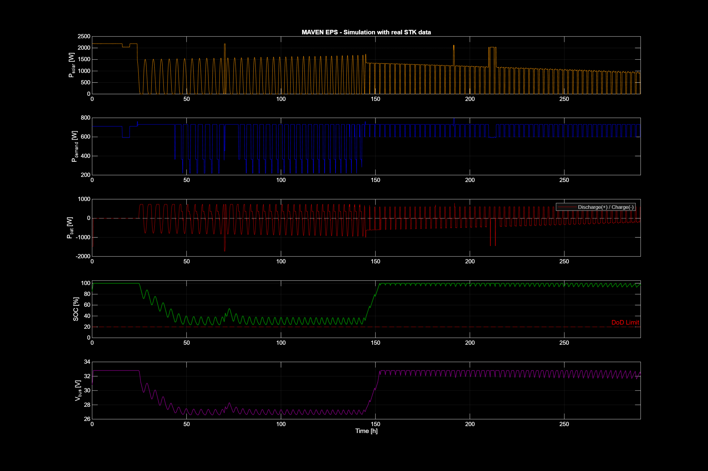
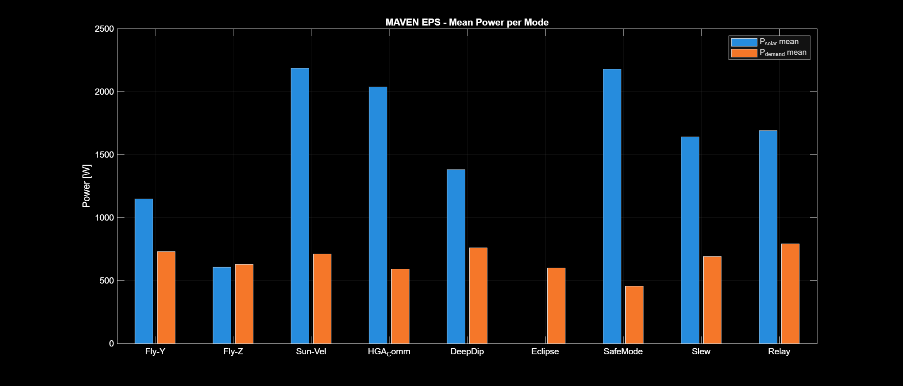
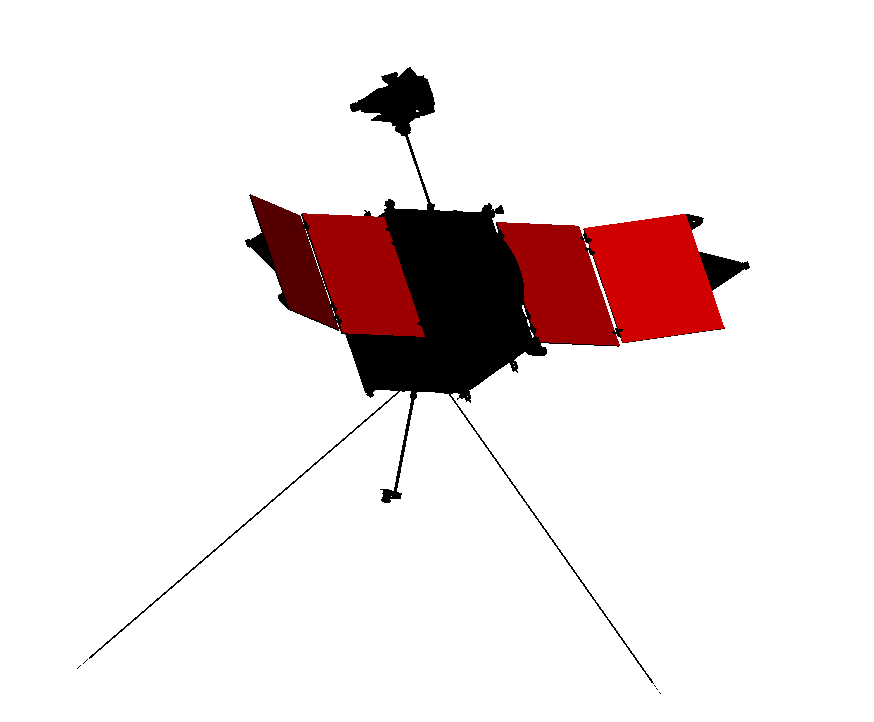

# MAVEN Electrical Power Subsystem (EPS)

EPS design for MAVEN: solar array generation, battery energy storage, bus
regulation and distribution, plus the full power-cycle simulation driven by
STK solar geometry. Full architecture and calculations are in
[`maven-reverse-engineering-report.pdf`](../../maven-reverse-engineering-report.pdf).

## Key results

### Architecture

The EPS is based on two fixed solar-array wings — four panels in a split
"gull-wing" configuration — two 28 V Li-ion batteries and the bus
conditioning/distribution electronics. Fixed panels are kept Sun-pointed by
the body orientation during nominal operations; the canted outer panels
improve passive aero-stability during Deep Dip. The arrays contain more than
2000 solar cells over ~12 m² and generate between 1150 W and 1700 W.

### Solar array sizing

| Quantity | Value |
|---|---|
| Required SA power | 1868.21 W |
| Power density (BoL / EoL) | 59.9 / 40.36 W/m² |
| Required area (worst case → optimized) | 46.29 m² → 20.71 m² |
| Cells | 15,354 × CESI CTJ30 triple-junction |

### Battery sizing

| Quantity | Value |
|---|---|
| Architecture | 2 × 60 Ah, 8S1P per battery, 28 V nominal (24.0–32.8 V) |
| Energy (computed / rated per battery) | 1543.83 Wh / 2764.8 Wh |
| DoD limit | 80% (SOC floor 20%) |

### Bus regulation

DET (direct-energy-transfer) bus with shunt bang-bang regulation. When the
battery is full and the load is lower than the solar input, the surplus is
dissipated by the shunt; priority-based load shedding protects the bus below
SOC = 30%.

### Power budget per mode

| Mode | Total demand [W] | P_solar (mean) [W] |
|---|---|---|
| Fly-Y | 731 | 1148.9 |
| Fly-Z | 731 | 607.0 |
| Sun-Velocity | 711 | 2187.2 |
| HGA Comm | 593 | 2037.8 |
| Deep Dip | 761 | 1381.9 |
| Eclipse | 600 | 0.0 |
| Safe Mode | 456 | 2180.6 |
| Slew | 711 | 1642.2 |
| Relay | 793 | 1691.7 |

The demand table (`power_demand_table` in `matlab/maven_standalone_simulation.m`)
sums to the per-mode totals in the report's EPS power budget; the mean
`P_solar` per mode matches the report values.

### Mass, power & data budget

| | Component | Mass [kg] | Remarks |
|---|---|---|---|
| Generation | Solar arrays (2 wings) | 80.3 | +10% DMM → 88.3 |
| Storage | Battery 1 (LP 33165) | 18.0 | +5% DMM → 18.9 |
| | Battery 2 (LP 33165) | 18.0 | +5% DMM → 18.9 |
| Conditioning | PCU / shunt regulator | 8.0 | +10% DMM → 8.8 |
| Distribution | Power harness | 6.0 | +10% DMM → 6.6 |
| Margins | Subsystem 20% | | |
| **Total allocated mass** | | **169.8** | |

EPS housekeeping telemetry: 19 analogue channels, 16 bit, sampled at 1/60 Hz,
83.9 kbit/orbit, 125.9 kbit/orbit with 50% margin.

## Power-cycle simulation (MATLAB)

The full power cycle is simulated over the first deep-dip campaign window
**11–23 Feb 2015** (11 Feb 2015 12:00 → 23 Feb 2015 14:26, 17,426 samples at
Δt = 60 s), using the STK solar panel power profile directly (`P_solar` from
`maven-solar-panel-power.txt`), the eclipse flag for mode override and the
attitude schedule for pointing mode. The Li-ion pack is the 2 × 2764.8 Wh
string sized above.

The simulation yields `E_solar / E_demand = 1.35`, `SOC_min = 23.5%` (floor
20%), zero energy deficit and load shedding confined to eclipse passes
(1,907 of 17,426 samples, 10.94%, consistent with the 10.7% STK eclipse
fraction).





The analytical model `P = η·A·S/r²·cosθ` is used only for validation against
the STK profile (R² = 0.9977 over 13,184 sunlit samples).

## STK data files



Direct STK exports over the **11–23 Feb 2015** window, corresponding to the
report's `MAVEN_Solar_Panel_Power.txt` and related EPS exports. The
`MAVEN1`/`MAVEN2` prefixes in the original headers describe the STK satellite
object and are irrelevant to the results.

### `stk/maven-solar-panel-power.txt`

Solar panel power [W] and solar intensity at 10 s cadence — the generation
input of the simulation (2189 W at window start).

### `stk/maven-eclipse-summary.txt` / `stk/maven-sunlit.txt`

Penumbra/umbra intervals and sunlit intervals for the window (60 eclipse
events, 10.7% of samples in eclipse). The sunlit table cross-validates the
eclipse flag.

### `stk/maven-solar-au-range.txt` / `stk/maven-beta-angle.txt`

Sun distance [AU] (1.407–1.418) and solar beta angle (−47.3°…−26.4°) over the
window; used to compute the actual solar flux and the `P_solar` analytical
validation model.

### `stk/maven-panel-incidence.txt`

Panel–Sun incidence angle [deg] at 10 s cadence (mean 64.1° in sunlit
intervals). Fly-Z operates near the grazing limit (θ ≈ 84°), which is why
that mode is battery-buffered.

### `stk/maven-mars-inertial-state.txt`

Mars-inertial position/velocity [km, km/s] at 10 s cadence; periapsis altitude
derived as 133 km at the deep-dip minimum.

### `stk/maven-access-earth-to-mars.txt`

DSN (DSS-14/43/63) and MSL Curiosity relay access windows; drives the Relay
mode of the simulation.

### `stk/maven2-panels-*.txt`

MAVEN2 exports of the panel–Sun incidence for the two canted gull-wing outer
panels (+20° / −20°).

## Folder contents

```
eps/
├── stk/          # STK exports (see above)
├── matlab/       # runnable pipeline (snake_case)
├── data/         # generated: maven_stk_data.mat, maven_sim_results.mat,
│                 # maven-eps-*.csv (timeseries, orbit summary, mode analysis,
│                 # validation, subsys power, summary stats)
├── figures/      # simulation plots
└── screenshots/  # STK captures
```

## Reproducibility

- **MATLAB R2026a**: run the pipeline in order from `matlab/`

  ```matlab
  run('maven_stk_data_loader.m');           % STK → data/maven_stk_data.mat
  run('maven_standalone_simulation.m');     % → data/maven_sim_results.mat
  run('maven_postprocessing.m');            % → data/maven-eps-*.csv, figures/
  ```

  Expected key outputs: 17,426 samples, `SOC_min = 23.5%`,
  `E_solar/E_demand = 1.35`, load shedding = 10.94%.

- **STK 13** to open the scenario under `stk/maven-stk-scenario` and reproduce
  the solar geometry exports over the **11–23 Feb 2015** analysis interval.
