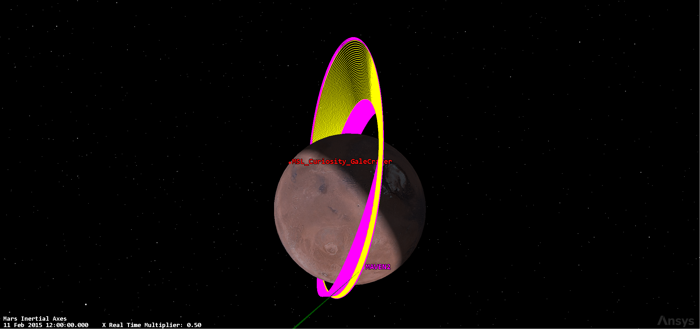
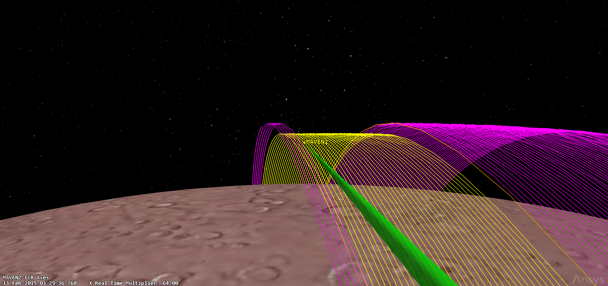

# MAVEN Mission Analysis & Propulsion System

Mission analysis and propulsion sizing for MAVEN: the Earth–Mars transfer
design, the ΔV budget, and the Mars science-phase simulation. Full
architecture and calculations are in
[`maven-reverse-engineering-report.pdf`](../../maven-reverse-engineering-report.pdf).

## Key results

### Trajectory parameters

| Parameter | Value | Notes |
|---|---|---|
| Earth parking orbit | 167 × 315 km, i = 26.7° | pre-injection coast |
| Transfer type | Type-II heliocentric | ToF ~10 months, transfer angle ~229° |
| Launch energy C3 | ~13.18 km²/s² (RE: 12.01) | launch-window scan |
| Arrival hyperbolic excess V∞ | ~3.17 km/s (RE: 3.1832) | |
| MOI | single burn → 35 h parking orbit | periapsis ~380 km |
| Science orbit | 150–155 × 6000 km, i = 75° | period ~4.5 h |
| Deep-dip periapsis | ~125 km | 5 campaigns × 5 days |
| Nominal density corridor | 0.05–0.15 kg/km³ | atmospheric-driven navigation |
| EOM | periapsis raised to ~250 km | >50 y lifetime |

![MAVEN launch window: C3 [km²/s²] vs departure/arrival](figures/launch-window-c3.png)

### ΔV budget

| Mission phase | ΔV [m/s] |
|---|---|
| Cruise navigation (TCMs) | 5.51 |
| Mars capture (MOI) | 1230.4 |
| Transition to science orbit (PRM/PLM) | 549.5 |
| Deep-dip support | 45.7 |
| Orbit trim / station-keeping | 22.2 |

The per-maneuver breakdown (TCM, MOI, PRM/PLM, DDM, OTM), with margins and
rationale, is in `maven-trajectory-analysis.xlsx`.

### Propulsion sizing

| Parameter | Value |
|---|---|
| Propellant | Hydrazine (N₂H₄), monopropellant |
| Main thrusters | 6 × MR-107S, 170 N, Isp 230 s |
| TCM thrusters | 6 × MR-106L, 22 N, Isp 232 s |
| ACS thrusters | 8 × MR-103G, 1 N, Isp 213 s |
| Dry / wet mass | 809 kg / 2219 kg (MR = 2.2855) |
| Propellant mass (with margins) | 1317 kg |
| Propellant tank | Ti-6Al-4V cylinder, r = 0.493 m, t = 1.3 mm, 34.55 kg |
| Pressurant | Helium, 4.86 kg, spherical tank 21.13 kg |
| Propulsion system mass | 80.06 kg |
| Power peak / average | 502.6 W / 129.3 W |

## Mars science-phase simulation (STK / Astrogator)

The representative science phase is built in STK Astrogator as a Mission
Control Sequence (MCS) over 11–23 Feb 2015, around one deep-dip campaign.
The scenario is under [`stk/maven-stk-scenario`](../../stk/maven-stk-scenario)
and propagates with the `MAVEN_High_Precision` propagator: RKF7(8) numerical
integrator, Mars gravity field (degree/order 4×0), exponential Mars
atmospheric drag and spherical SRP.

The orbital MCS reduces to three propagation arcs connected by the two
deep-dip trim maneuvers:

```
Initial State → Propagate → DD1_WalkIn_TS (DV1) → Propagate → DD1_WalkOut_TS (DV2) → Propagate
```



- **DD1_WalkIn_TS** targets the deep-dip periapsis: impulsive ΔV of
  −4.18 m/s (12 Feb 2015 11:55) lowers periapsis to the 125 km dip.
- **DD1_WalkOut_TS** restores the nominal orbit: impulsive ΔV of
  +10.65 m/s (17 Feb 2015 12:26) raises periapsis back to 150 km.

| Maneuver | Date (UTC) | ΔV | Periapsis target | Achieved |
|---|---|---|---|---|
| Walk-in (DD1_DV1) | 12 Feb 2015 11:55 | −4.18 m/s | 125 km | 125.003 km |
| Walk-out (DD1_DV2) | 17 Feb 2015 12:26 | +10.65 m/s | 150 km | 150.016 km |



## Folder contents

```
ma-ps/
├── interplanetary_trajectory_design.m   # Earth–Mars Lambert launch-window scan
├── mars_explorer.m                      # Mars science-orbit propagation (60 days)
├── maven-trajectory-analysis.xlsx       # ΔV budget breakdown table
├── func/                                # MATLAB helper functions
├── figures/                             # exported plots
└── screenshots/                         # STK screenshots
```

### Scripts

- **`interplanetary_trajectory_design.m`** — launch-window scan over the
  Earth–Mars transfer using Lambert arcs at the departure/arrival epochs
  (MAVEN launch 18-Nov-2013, MOI 22-Sep-2014). Produces the C3 and arrival
  V∞ windows.
- **`mars_explorer.m`** — numerical propagation of the nominal science orbit
  (150 × 6200 km, i = 75°) with `propagateMAVENOrbit` (J2/J3, SRP, drag,
  Mars atmosphere surrogate) using `ode113`, over 60 days, with a
  correction-maneuver arc and periapsis-altitude vs density-corridor plots.

### Functions (`func/`)

`astroConstants.m`, `kep2car.m`, `lambertMR.m`, `propagateMAVENOrbit.m`,
`uplanet.m`, plus the `timeConversion/time/` suite.

## Reproducibility

- **MATLAB** (R2021b or newer) for both scripts; the top-level scripts add
  `func/` and `func/timeConversion/time/` to the path automatically.
- **STK 13** to open the scenario under `stk/maven-stk-scenario` and run the
  Astrogator MCS.