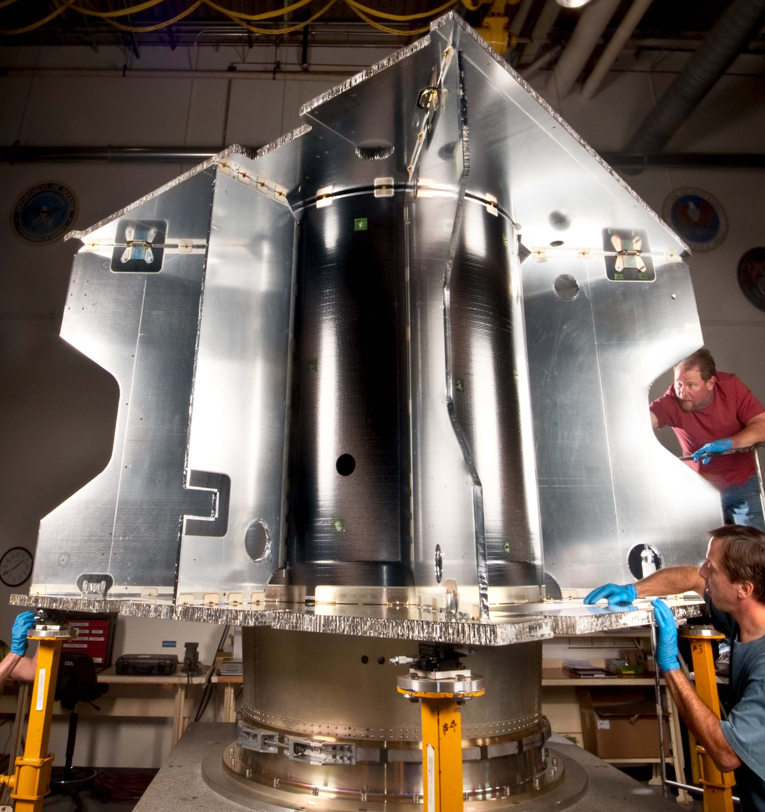

# MAVEN Structure (STR)

STR design for MAVEN: the box-and-panels bus, the material selection, the
mechanisms and the launcher accommodation that define the mechanical
architecture of the spacecraft. Full architecture and calculations are in
[`maven-reverse-engineering-report.pdf`](../../maven-reverse-engineering-report.pdf).

## Key results

### Architecture

The bus is a box-and-panels structure: flat honeycomb sandwich plates with
graphite face sheets joined by metal fittings. This layout maximizes bending
stiffness and buckling strength while keeping the whole structure at only
**125 kg**. The primary structure is cube shaped (2.3 m × 2.3 m × 2 m), built
around a 152 cm central core cylinder that encloses the 1640 kg hydrazine tank
and carries the main vertical launch-load path. Two 3.8 cm thick square panels
form the fore and aft decks, supported by five gusset panels; the bus is split
into four bays for access during assembly and testing. The structure is
designed to react the full launch axial force of **~271 kN** at the launch
vehicle interface, including accelerations up to 6 g.



### Primary / secondary / tertiary structure

- **Primary**: the cube-shaped bus, the fore/aft decks and the central core
  cylinder described above. High stiffness avoids dynamic interaction between
  the spacecraft and the launch vehicle.
- **Secondary**: self-sustaining elements contributing negligibly to the main
  load transfer, sized for launch vibration and quasi-static loads: the solar
  arrays (sized to end of life, accounting for space-environment
  degradation), the IUVS baffles (rejecting off-axis light), the MLI blanket
  supports and the HGA reflector (honeycomb core between composite face
  sheets).
- **Tertiary**: minor items — cabling and harnesses (serpentine type for the
  batteries), pipe mounting and constraints — sized for the critical launch
  and operational environments, since low frequencies directly couple with
  the spacecraft dynamics.

### Material selection

| Component | Material | Driver |
|---|---|---|
| Bus panels | Al honeycomb / composite faces (CFRP) | Stiffness-to-mass (launch loads) |
| Fuel tank | Ti-6Al-4V | N₂H₄ chemical compatibility |
| Pressurant tank | Ti-lined COPV | Mass saving + He impermeability |
| MLI blankets | Ge-coated Kapton (conductive) | 1 V differential-charging limit |
| Radiators | Al honeycomb + OSR / Ag-FEP | Passive thermal rejection |
| Solar cells | GaAs triple-junction (CTJ30) | η at 1.52 AU solar flux |
| Batteries | Li-ion (LP 33165), μ-foil | Residual B < 0.045 nT |
| LPW probes | Tin-coated Ti | Atomic-O erosion at periapsis |
| NGIMS MLI | All-Kapton (no Dacron) | Decontamination bake-out (180 °C) |
| LPW boom coating | DAG 213 graphite/epoxy | Boom thermal stability |

Composite face sheets follow the LM-1000 bus heritage (Juno, GRAIL, MRO): CFRP
for high specific stiffness and low CTE mismatch with the Al cores; the solar
array substrate is Al-honeycomb and the HGA dish is Al honeycomb with a
reflective surface (MRO X-band heritage).

### Magnetic cleanliness

To meet the Particles-and-Fields magnetic-cleanliness requirement, the residual
magnetic field must stay below **0.045 nT** at each MAG sensor. This is
achieved with compensation wiring on the solar-array back side in a U-string
geometry and 20 µm high-permeability foil wrappings on all rotary actuators,
batteries and ACS thrusters. All fasteners and pyro devices are screened and
demagnetized.

### Mechanisms

| Mechanism | Type | Actuation |
|---|---|---|
| APP gimbals | 2-axis, 175° range | Motor-driven (continuous) |
| APP boom deploy | Hinged, lockable | Release + swing-out |
| SWEA boom | 1.65 m, hinged | Release + swing-out |
| LPW booms (×2) | 7 m stacer | Stored-energy release |
| SA deploy | Gull-wing, 4 panels | Release + spring hinge |
| NGIMS cap | Break-off seal | Pyrotechnic (one-shot) |
| SEP paddles | Attenuator flaps | Commandable swing |
| IUVS mirrors | Scan + flip | Motor-driven (internal) |
| Separation | SC–Centaur | Pyro nuts |

MAVEN favors fixed geometry to minimize single-point failures: the only
continuously actuated mechanism is the **APP**, a 1.2 m deployable boom with
two motor-driven gimbals (175° range, 2–10 slews/orbit) that orients NGIMS,
IUVS and STATIC independently of the spacecraft attitude. The SWEA boom
(1.65 m, opposite side) deploys via hinges with release devices; the two 7 m
LPW stacer booms extend by stored elastic energy (no motor); the two 0.68 m
MAG boomlets at the solar-array tips are fixed structural extensions. All four
deployable booms remain stowed until commissioning after MOI.

### Distribution of elements

- **External**: instruments requiring variable observation geometry (NGIMS,
  IUVS, STATIC) sit on the APP for local pointing toward ram, limb and stellar
  occultation targets; LPW, SWEA and MAG are on booms/boomlets to maximize
  distance from the bus and minimize magnetic interference; the solar arrays
  use the fixed gull-wing configuration (power + aerodynamic stability during
  Deep Dip); the body-fixed HGA supports high-rate Earth communications at the
  cost of periodic pointing trade-offs. Radiators and optical instruments are
  positioned to avoid shadowing and mutual obstruction.
- **Internal**: the four bays host the main subsystems (batteries, reaction
  wheels, avionics, power electronics, communication hardware) distributed for
  center-of-mass balancing, accounting for the COM evolution driven by
  propellant and pressurant depletion. Internal components mount on the
  aluminum load-bearing structure, providing mechanical integration and
  thermal continuity for heat redistribution.

### Launcher & fairing

The launcher is an **Atlas V-401** (4 m payload fairing, no solid rocket
boosters, single-engine Centaur upper stage). The spacecraft connects to the
Centaur through a clamp-band/separation-ring system at the aft side of the bus:
ascent loads enter the aft deck and are transferred through the gusset panels
and the central core surrounding the hydrazine tank, keeping the heaviest item
close to the launch axis. The compact launch configuration recovers its
operational geometry only after separation — the fairing radial envelope, the
protection of the cells during ascent and the final solar-array geometry drive
the gull-wing deployment, while the APP and the four deployable booms remain
stowed until commissioning to avoid coupling between appendage modes and
launcher-induced vibration.

### Structure mass sizing

The spacecraft (m = 2454 kg) is modeled as an equivalent aluminum cylinder
(L = 2 m, r_ext = 0.94 m, ρ = 2800 kg/m³, E = 68 GPa), sized for conservative
natural frequencies of **50 Hz** lateral and **75 Hz** axial (Atlas V requires
> 8 Hz and > 15 Hz). From the Euler–Bernoulli beam approximation:

```
I = m·L³/E·(f_lat/0.56)² = 2.3×10⁹ mm⁴  →  t = 0.88 mm  →  m_structure = 29.2 kg
```

The difference with the literature value of 125 kg is due to the coarse
geometric model and the neglect of the graphite face sheets and metallic
fittings. In the mass budget the STR block is therefore split into the
reverse-sized primary structure (32.12 kg, 10% DMM) and a residual
`Δ_MISSING-STR` block (298.96 kg) scaled from the MRO structural surrogate.

## Folder contents

```
str/
└── images/   # maven-primary-structure.jpg (primary structure, NASA)
```

## Reproducibility

- No simulation: the STR design is taken from the report's Structure section.
  The structure mass sizing follows the equivalent-cylinder model of the
  report (f_lat = 50 Hz, f_long = 75 Hz, t = 0.88 mm, m = 29.2 kg).
- The image is the primary-structure photograph from the report (NASA,
  `35453_maven20110926_PIA14754_MAVEN-structure.jpg`), unmodified.
