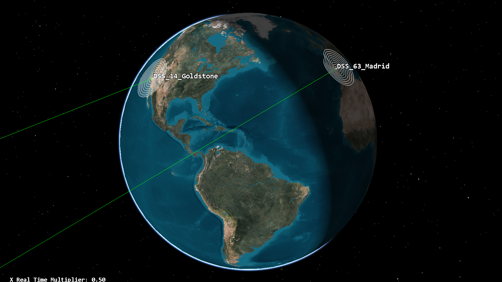
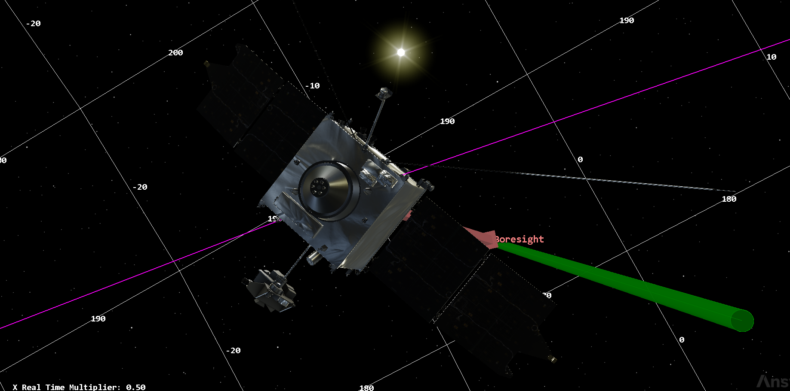
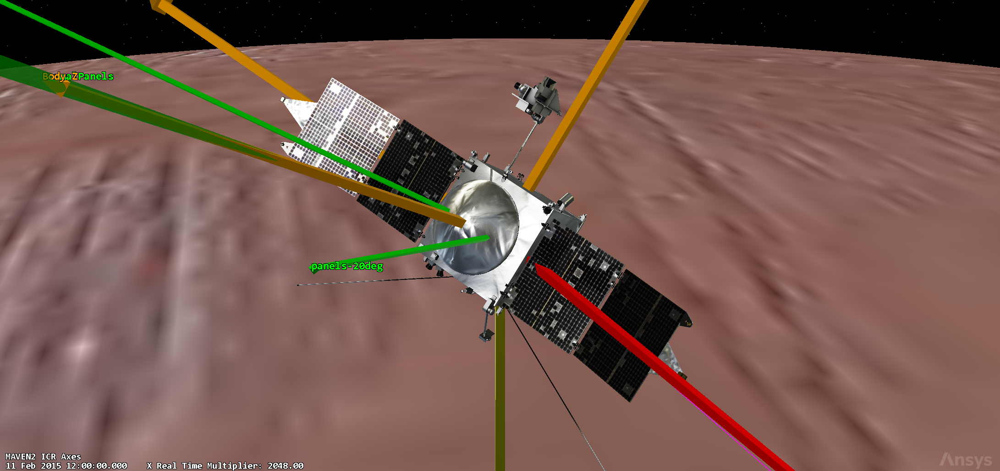

# MAVEN Tracking, Telemetry & Telecommand System (TTMTC)

TTMTC design for MAVEN: the X-band Earth link (HGA + 2 LGAs), the UHF/Electra
relay to the surface, the DSN ground segment and the link budgets that close
the RF chain. Full architecture and calculations are in
[`maven-reverse-engineering-report.pdf`](../../maven-reverse-engineering-report.pdf).

## Key results

### Communication architecture

Dual-chain design routed through CDH/SSR: a primary X-band Earth link (HGA for
high-rate, LGAs for low-rate) and a secondary UHF proximity relay (Electra),
following the two-hop relay paradigm. The Electra is single-string, with
spacecraft-level redundancy provided by the dual-LVDS CDH A/B.

### Unified link budget

Computed in STK over a 7-day window (1–8 Dec 2014) and cross-validated
analytically (error <0.1%). Three representative links close with positive
margin:

| Link | Freq | Distance | EIRP | G/T | C/N₀ | Eb/N₀ (STK / anal.) | Req | Margin |
|---|---|---|---|---|---|---|---|---|
| HGA DL (100 W, 271 kbps) | 8.4 GHz | 2.78×10⁸ km | 59.68 dBW | 50.91 dB/K | 58.15 dB-Hz | 3.82 / 3.82 dB | 2.50 dB | **+1.32 dB** |
| LGA DL (10 W, 10 bps) | 8.4 GHz | 2.78×10⁸ km | 13.0 dBW | 50.12 dB/K | 13.18 dB-Hz | 3.18 / 3.18 dB | 2.00 dB | **+1.18 dB** |
| UHF UL relay (10 W, 128 kbps) | 401.5 MHz | 8.73×10³ km | 10.0 dBW | −21.62 dB/K | 55.71 dB-Hz | 4.63 / 4.63 dB | 3.00 dB | **+1.63 dB** |

The STK runs behind the HGA and LGA rows are `link-budget/goldstone-hga-enhanced.txt`
and `link-budget/goldstone-lga-enhanced.txt`; the relay row is
`link-budget/uhf-curiosity-link-budget.txt`.

### Antenna chain

| Element | Type | Frequencies | Max data rate | Gain | Coding / mod. | Min Eb/N₀ | FOV |
|---|---|---|---|---|---|---|---|
| HGA | 2 m parabolic dual-reflector | 7.2 GHz Rx / 8.4 GHz Tx | 550 kbps DL / 2 kbps UL | 42.68 dB Tx / 41.35 dB Rx | Conv+RS, QPSK | 8 / 7.5 dB | 1.04° |
| LGA ×2 | patch | X-band | 993 bps DL / 550 bps UL | 3–7 dB | Conv Rc=1/2, BPSK | 8 / 7.5 dB | 156° |
| Electra | 26.1 cm quadrifilar helix | 390–405 MHz Rx / 435–450 MHz Tx | 853.333 kbps coded | 2.8 dBic @437 / 3.1 dBic @401 MHz | Conv+LDPC Rc=5/6, BPSK/QPSK | 6 / 7 dB | 120° |

The HGA is fixed along +Z (boresight toward Earth during science passes); the
two LGAs are mounted at −22° and +158° about Y (10 W SSPA, maintaining a 10 bps
link); the UHF helical sits at +130° about Y, 3 dBi RHCP, closing 128 kbps with
Curiosity. The 100 W DL signal is carried by a TWTA; the SDST transponder
(3.2 kg) is full-duplex X-band with BER 10⁻⁵.

### Science-phase data volume

| Link | Schedule | Rate | Volume |
|---|---|---|---|
| HGA downlink | 2 passes × 5 h/week | 271 kbps | 9.8 Gbit/wk, ~478 Gbit/yr (60 GB) |
| LGA downlink | 5 passes × 7 h/week | ~2 kbps | 252 Mbit/wk, ~12 Gbit/yr (1.5 GB) |
| Uplink | 2 × 1 h/week | 2 kbps | ~706 Mbit/yr (88 MB) |
| UHF relay | ~30 min/pass | ≤2048 kbps uncoded | ≤2 Gbit/pass |

49 usable weeks per year (3-week superior-conjunction command moratorium).

### Ground segment (DSN)

| Complex | 70 m | 34 m |
|---|---|---|
| Goldstone | DSS-14 | DSS-24/25/26 |
| Madrid | DSS-63 | DSS-54/55/56 |
| Canberra | DSS-43 | DSS-34/35/36 |

X-band 8.4 GHz, TRL 9. Sized for the worst-case Earth–Mars range of 401×10⁶ km.
The 34 m antennas are justified analytically: 244.691 kbps at 67.2972 dB gain
versus the literature value of 271 kbps at 68.3 dB.

### Mass & power

| Item | Mass |
|---|---|
| HGA | 19.1 kg |
| LGAs (×2) | 2 × 0.8 kg |
| Electra | 6.5 kg |
| TWTA | 0.95 kg |
| SDST | 3.2 kg |
| **Total (+10%)** | **31.35 → 34.5 kg** |

TTMTC mass is the lower bound of the 48.5–56.6 kg statistical range (6–7% of the
809 kg dry mass). Power: TWTA 100 W RF → 172 W input → **206.4 W** with 20%
margin.

## TTMTC simulation (STK)

Contact windows and link budgets were modeled in STK over a 7-day interval,
**1–8 Dec 2014** (early Primary Science Phase), and cross-validated
analytically with error <0.1%. The scenario lives under
[`stk/maven-stk-scenario`](../../stk/maven-stk-scenario) and contains the full
RF chain: `TX_HGA_Xband*` (8.4 GHz, QPSK, 271 kbps, 100 W, 2.0855 m dish),
`TX_LGA_Xband*` (BPSK, 10 bps, 10 W), `TX_UHF_Curiosity` (401.5275 MHz, BPSK,
128 kbps, EIRP 10 W), receivers `RX_HGA_Goldstone` (G/T 50.91 dB/K),
`RX_LGA_*`, `RX_UHF_Relay*`, `Receiver_UHF_Curiosity`, and facilities
`DSS_14_Goldstone`, `DSS_43_Canberra`, `DSS_63_Madrid` and
`MSL_Curiosity_GaleCrater`.

Goldstone is the representative link-budget case: Canberra and Madrid appear
only in the access reports, while the UHF relay is covered by the Curiosity
link.







## Folder contents

```
ttmtc/
├── access/         access reports (Goldstone / Canberra / Madrid / Curiosity)
├── range/          range time series (HGA–Goldstone, UHF–Curiosity)
├── link-budget/    link-budget reports (HGA, LGA, UHF relay)
└── screenshots/    STK captures
```

## Reproducibility

- **STK 2026 R1** to open the scenario under `stk/maven-stk-scenario`. The
  link-budget and access reports correspond to the **1–8 Dec 2014** interval;
  set the analysis interval accordingly (the scenario default of 11–23 Feb 2015
  serves the science-phase simulation, see `subsystems/ma-ps`).
- The `link-budget/` and `access/` files are direct STK exports, unmodified.